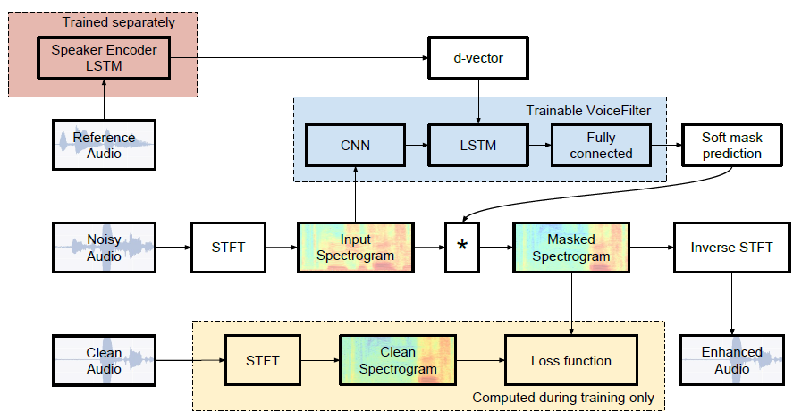
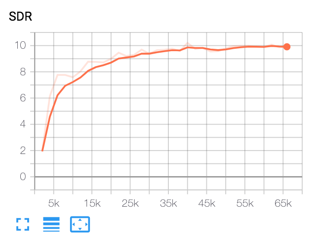
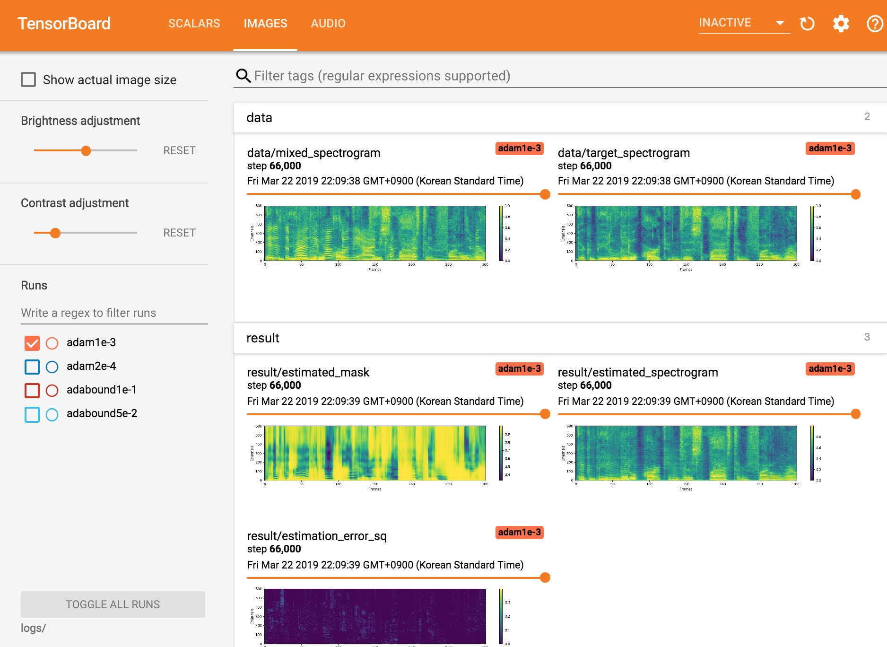

# VoiceFilter

## Note from Seung-won (2020.10.25)

Hi everyone! It's Seung-won from MINDs Lab, Inc.
It's been a long time since I've released this open-source,
and I didn't expect this repository to grab such a great amount of attention for a long time.
I would like to thank everyone for giving such attention, and also Mr. Quan Wang (the first author of the VoiceFilter paper) for referring this project in his paper.

Actually, this project was done by me when it was only 3 months after I started studying deep learning & speech separation without a supervisor in the relevant field.
Back then, I didn't know what is a power-law compression, and the correct way to validate/test the models.
Now that I've spent more time on deep learning & speech since then (I also wrote a paper published at [Interspeech 2020](https://arxiv.org/abs/2005.03295) 😊),
I can observe some obvious mistakes that I've made.
Those issues were kindly raised by GitHub users; please refer to the
[Issues](https://github.com/mindslab-ai/voicefilter/issues?q=is%3Aissue+) and [Pull Requests](https://github.com/mindslab-ai/voicefilter/pulls) for that.
That being said, this repository can be quite unreliable,
and I would like to remind everyone to use this code at their own risk (as specified in LICENSE).

Unfortunately, I can't afford extra time on revising this project or reviewing the Issues / Pull Requests.
Instead, I would like to offer some pointers to newer, more reliable resources:

- [VoiceFilter-Lite](https://arxiv.org/abs/2009.04323):
This is a newer version of VoiceFilter presented at Interspeech 2020, which is also written by Mr. Quan Wang (and his colleagues at Google).
I highly recommend checking this paper, since it focused on a more realistic situation where VoiceFilter is needed.
- [List of VoiceFilter implementation available on GitHub](https://paperswithcode.com/paper/voicefilter-targeted-voice-separation-by):
In March 2019, this repository was the only available open-source implementation of VoiceFilter.
However, much better implementations that deserve more attention became available across GitHub.
Please check them, and choose the one that meets your demand.
- [PyTorch Lightning](https://www.pytorchlightning.ai/):
Back in 2019, I could not find a great deep-learning project template for myself,
so I and my colleagues had used this project as a template for other new projects.
For people who are searching for such project template, I would like to strongly recommend PyTorch Lightning.
Even though I had done a lot of effort into developing my own template during 2019
([VoiceFilter](https://github.com/mindslab-ai/voicefilter) -> [RandWireNN](https://github.com/seungwonpark/RandWireNN)
-> [MelNet](https://github.com/Deepest-Project/MelNet) -> [MelGAN](https://github.com/seungwonpark/melgan)),
I found PyTorch Lightning much better than my own template.

Thanks for reading, and I wish everyone good health during the global pandemic situation.

Best regards, Seung-won Park

---

Unofficial PyTorch implementation of Google AI's:
[VoiceFilter: Targeted Voice Separation by Speaker-Conditioned Spectrogram Masking](https://arxiv.org/abs/1810.04826).



## Result

- Training took about 20 hours on AWS p3.2xlarge(NVIDIA V100).

### Audio Sample

- Listen to audio sample at webpage: http://swpark.me/voicefilter/


### Metric

| Median SDR             | Paper | Ours |
| ---------------------- | ----- | ---- |
| before VoiceFilter     |  2.5  |  1.9 |
| after VoiceFilter      | 12.6  | 10.2 |



- SDR converged at 10, which is slightly lower than paper's.


## Dependencies

1. Python and packages

    This code was tested on Python 3.6 with PyTorch 1.0.1.
    Other packages can be installed by:

    ```bash
    pip install -r requirements.txt
    ```

1. Miscellaneous 

    [ffmpeg-normalize](https://github.com/slhck/ffmpeg-normalize) is used for resampling and normalizing wav files.
    See README.md of [ffmpeg-normalize](https://github.com/slhck/ffmpeg-normalize/blob/master/README.md) for installation.

## Prepare Dataset

1. Download LibriSpeech dataset

    To replicate VoiceFilter paper, get LibriSpeech dataset at http://www.openslr.org/12/.
    `train-clear-100.tar.gz`(6.3G) contains speech of 252 speakers, and `train-clear-360.tar.gz`(23G) contains 922 speakers.
    You may use either, but the more speakers you have in dataset, the more better VoiceFilter will be.

1. Resample & Normalize wav files

    First, unzip `tar.gz` file to desired folder:
    ```bash
    tar -xvzf train-clear-360.tar.gz
    ```

    Next, copy `utils/normalize-resample.sh` to root directory of unzipped data folder. Then:
    ```bash
    vim normalize-resample.sh # set "N" as your CPU core number.
    chmod a+x normalize-resample.sh
    ./normalize-resample.sh # this may take long
    ```

1. Edit `config.yaml`

    ```bash
    cd config
    cp default.yaml config.yaml
    vim config.yaml
    ```

1. Preprocess wav files

    In order to boost training speed, perform STFT for each files before training by:
    ```bash
    python generator.py -c [config yaml] -d [data directory] -o [output directory] -p [processes to run]
    ```
    This will create 100,000(train) + 1000(test) data. (About 160G)


## Train VoiceFilter

1. Get pretrained model for speaker recognition system

    VoiceFilter utilizes speaker recognition system ([d-vector embeddings](https://google.github.io/speaker-id/publications/GE2E/)).
    Here, we provide pretrained model for obtaining d-vector embeddings.

    This model was trained with [VoxCeleb2](http://www.robots.ox.ac.uk/~vgg/data/voxceleb/vox2.html) dataset,
    where utterances are randomly fit to time length [70, 90] frames.
    Tests are done with window 80 / hop 40 and have shown equal error rate about 1%.
    Data used for test were selected from first 8 speakers of [VoxCeleb1](http://www.robots.ox.ac.uk/~vgg/data/voxceleb/vox1.html) test dataset, where 10 utterances per each speakers are randomly selected.
    
    **Update**: Evaluation on VoxCeleb1 selected pair showed 7.4% EER.
    
    The model can be downloaded at [this GDrive link](https://drive.google.com/file/d/1YFmhmUok-W76JkrfA0fzQt3c-ZsfiwfL/view?usp=sharing).

1. Run

    After specifying `train_dir`, `test_dir` at `config.yaml`, run:
    ```bash
    python trainer.py -c [config yaml] -e [path of embedder pt file] -m [name]
    ```
    This will create `chkpt/name` and `logs/name` at base directory(`-b` option, `.` in default)

1. View tensorboardX

    ```bash
    tensorboard --logdir ./logs
    ```
    
    

1. Resuming from checkpoint

    ```bash
    python trainer.py -c [config yaml] --checkpoint_path [chkpt/name/chkpt_{step}.pt] -e [path of embedder pt file] -m name
    ```

## Evaluate

```bash
python inference.py -c [config yaml] -e [path of embedder pt file] --checkpoint_path [path of chkpt pt file] -m [path of mixed wav file] -r [path of reference wav file] -o [output directory]
```

## Possible improvments

- Try power-law compressed reconstruction error as loss function, instead of MSE. (See [#14](https://github.com/mindslab-ai/voicefilter/issues/14))

## Author

[Seungwon Park](http://swpark.me) at MINDsLab (yyyyy@snu.ac.kr, swpark@mindslab.ai)

## License

Apache License 2.0

This repository contains codes adapted/copied from the followings:
- [utils/adabound.py](./utils/adabound.py) from https://github.com/Luolc/AdaBound (Apache License 2.0)
- [utils/audio.py](./utils/audio.py) from https://github.com/keithito/tacotron (MIT License)
- [utils/hparams.py](./utils/hparams.py) from https://github.com/HarryVolek/PyTorch_Speaker_Verification (No License specified)
- [utils/normalize-resample.sh](./utils/normalize-resample.sh.) from https://unix.stackexchange.com/a/216475
